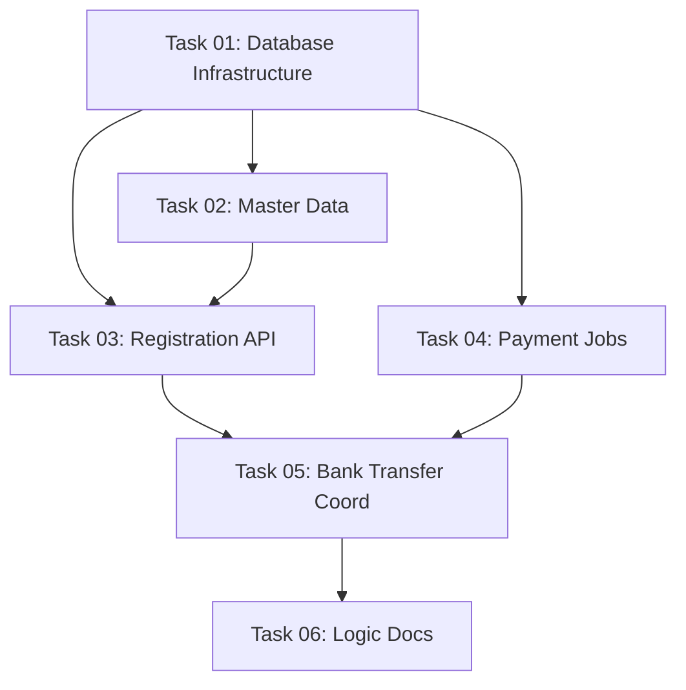

# Task File Examples

This document provides complete examples of IMPLEMENTATION and COORDINATION task files.

---

## Example 1: IMPLEMENTATION Task

Below is a minimal but complete example of an IMPLEMENTATION task file:

```markdown
---
task_id: "02"
title: "Registration API Flow"
description: "Develop the 2-step user registration API: email submission and personal info."
type: IMPLEMENTATION
phase: 2
status: pending
estimated_effort: L
complexity: medium
risk: medium
depends_on: ["01"]
date: "2026-04-01"
changelog:
  - version: 1.0
    date: "2026-04-01"
    summary: Initial task specification.
---

# Context
- **Requirement**: [2026-04-01-update-user-plan-logic.md](../../requirements/2026-04-01-update-user-plan-logic.md)
- **Parent Task**: [2026-04-01-user-plan-implementation-tasks.md](../2026-04-01-user-plan-implementation-tasks.md)
- **Applicable Workflows (MANDATORY)**: `/execute-api-task`
- **Applicable Skills (MANDATORY)**: `bks-be-api-standard`

---

# Task 02: Registration API Flow

## Description
Develop the 2-step user registration API: email submission and personal info. References Flow #1 and BR-001, BR-002 from the requirement.

## Requirements

### 1. Email Submission Endpoint (NEW)

**File**: `app/Http/Controllers/Api/RegistrationController.php`
**Method**: `submitEmail(RegisterEmailRequest $request): JsonResponse`

**Service**: `Api\\Registration\\RegistrationService::submitEmail(SubmitEmailData $dto): void`

**DTO**: `app/DTOs/Api/Registration/SubmitEmailData.php` (fields: `email: string`)

**Logic**:
1. Check if email already exists. (**BR-001**)
   - Active user → throw 409.
   - Inactive user → allow re-registration.
2. Create User record: `email`, `status = Inactive`.
3. Generate UUID token in `verifies` table (24h expiry).
4. Dispatch `RegistrationInviteMail` (queued).
5. Return 200 (no user data exposed).

**Validation** (`RegisterEmailRequest`):
- `email`: required, email, max:255.

**Localization Keys**:
- `auth.registration.email_exists`: "Email is already registered."
- `auth.registration.invite_sent`: "Invitation email sent successfully."

### 2. Personal Info Endpoint (NEW)

**File**: `app/Http/Controllers/Api/RegistrationController.php`
**Method**: `submitPersonalInfo(RegisterPersonalInfoRequest $request): JsonResponse`

**DTO**: `app/DTOs/Api/Registration/SubmitPersonalInfoData.php` (fields: `token: string`, `name: string`, `password: string`)

**Service**: `Api\\Registration\\RegistrationService::submitPersonalInfo(SubmitPersonalInfoData $dto): User`

**Logic**:
1. Validate token from `verifies` table. If expired (>24h) → 410. (**BR-002**)
2. Update User: `name`, `phone`, `password` (hashed).
3. Keep `status = Inactive`.
4. Return user profile (limited fields).

**Validation** (`RegisterPersonalInfoRequest`):
- `token`: required, string.
- `name`: required, string, max:255.
- `password`: required, string, min:8, confirmed.

**Localization Keys**:
- `auth.registration.token_expired`: "The registration token has expired."

## API Endpoints Summary

| Method | URI | Description | Auth |
|---|---|---|---|
| `POST` | `/api/register/email` | Submit email | None |
| `POST` | `/api/register/personal-info` | Submit personal info | None (token) |

## Testing Hints
- **Factory needs**: `UserFactory`, `VerifyTokenFactory`.
- **Key test scenarios**:
  - Happy path: email → personal info completes.
  - Expired token (>24h) returns 410.
  - Duplicate active email returns 409.
- **Mock requirements**: Mail facade (assert `RegistrationInviteMail` dispatched).

## Status
- [ ] Create `app/DTOs/Api/Registration/SubmitEmailData.php` (DTO).
- [ ] Create `app/DTOs/Api/Registration/SubmitPersonalInfoData.php` (DTO).
- [ ] Create `RegisterEmailRequest` and `RegisterPersonalInfoRequest`.
- [ ] Create `app/Services/Api/Registration/RegistrationService.php` with both methods (accepting DTOs).
- [ ] Register `RegistrationService` in `ApiFactory` (add getter method — do NOT create a new factory file).
- [ ] Create `app/Http/Controllers/Api/RegistrationController.php` with 2 endpoints.
- [ ] Register routes in `routes/api.php`.
- [ ] Create `RegistrationInviteMail` Mailable (queued).
- [ ] Run `php artisan code:format`.
- [ ] Run `php artisan test --filter=RegistrationTest`.

## Acceptance Criteria
1. Email submission returns 200 and dispatches invitation email.
2. Expired token (>24h) returns 410 status.
3. Duplicate active email returns 409 status.
4. Personal info updates user but keeps `status = Inactive`.

## Error Scenarios
- Token expired → 410 Gone.
- Email already active → 409 Conflict.
- Invalid email format → 422 Unprocessable.

## Dependencies
- Task 01 (Database Infrastructure) — Models, Enums, Migrations.
```

---

## Example 2: COORDINATION Task

Below is a minimal example of a COORDINATION task file:

```markdown
---
task_id: "10"
title: "Bank Transfer Payment Flow"
type: COORDINATION
phase: 2
status: pending
estimated_effort: S
complexity: medium
risk: medium
depends_on: ["01", "02", "05", "06"]
date: "2026-04-01"
changelog:
  - version: 1.0
    date: "2026-04-01"
    summary: Initial task specification.
---

# Context
- **Requirement**: [2026-04-01-update-user-plan-logic.md](../../requirements/2026-04-01-update-user-plan-logic.md)
- **Parent Task**: [2026-04-01-user-plan-implementation-tasks.md](../2026-04-01-user-plan-implementation-tasks.md)
- **Applicable Workflows (MANDATORY)**: `/execute-api-task`
- **Applicable Skills (MANDATORY)**: `bks-be-api-standard`

---

# Task 10: Bank Transfer Payment Flow

## Description
Coordinate the bank transfer payment lifecycle across multiple tasks. This COORDINATION task ensures all bank-transfer-related logic is consistently implemented across the Registration API, Dashboard Management, and Background Jobs.

## Delegation Map

| Requirement | Delegated To | Section | Status |
|---|---|---|---|
| Bank transfer initiation & deadline | Task 02 | Requirements §4 (Payment Initiation) | ⏳ Pending |
| Manual confirmation | Task 05 | Requirements §2 (Confirm Payment) | ⏳ Pending |
| Business day calculation helper | Task 02 | Requirements §4 (calculateBankTransferDeadline) | ⏳ Pending |

## Requirements

### 1. Cross-cutting Business Rules

These rules MUST be consistently implemented across all delegated tasks:

- **BR-015**: Bank transfer deadline = 3 business days (Mon-Fri, excl. weekends).
- **BR-016**: Authorized users can confirm payment even after deadline expiry.
- **BR-017**: User cannot have multiple pending bank transfers for the same plan.

### 2. Edge Cases (All Delegated Tasks Must Handle)

- User pays after `bank_expired_at` → Manual override allowed.
- User pays wrong amount → record `payment_paid_amount` separately from `payment_amount`.
- Bank info not configured → Return 422.

## Acceptance Criteria
1. All delegated sub-requirements are implemented in their target tasks.
2. Business rules BR-015, BR-016, BR-017 are consistently applied.
3. Bank transfer deadline calculation is correct (verified via unit test in Task 02).

## Error Scenarios
- Bank info not configured → 422 "Bank transfer not available."
- Multiple pending bank transfers → 422 "Pending bank transfer already exists."

## Dependencies
- Task 01 (Database Infrastructure) — Models.
- Task 02 (Registration API) — Payment initiation.
- Task 05 (Dashboard Management) — Manual confirmation.
- Task 06 (Background Jobs) — `CheckBankTransferExpiryJob`.
```

---

## Example 3: Task Index File

```markdown
# Implementation Plan: User Plan Management

This document tracks the high-level implementation of User Plan Management based on the [2026-04-01-update-user-plan-logic.md](../requirements/2026-04-01-update-user-plan-logic.md).

## Progress Summary

- **Total Tasks**: 6
- **Completed**: 0 / 6 (0%)
- **Phase 1 (Foundation)**: ⏳ 0/2
- **Phase 2 (Backend API & Services)**: ⏳ 0/3
- **Phase 3 (Frontend)**: ⏳ 0/0
- **Phase 4 (Quality & Documentation)**: ⏳ 0/1
- **Estimated Total Effort**: 2M + 2L + 1S + 1M = ~7 days

Where status_icon = ✅ (all done) | 🔄 (in progress) | ⏳ (not started)

## Task Modules

### Phase 1: Foundation

| # | Task Module | Type | Effort | Link | Status |
| :--- | :--- | :--- | :--- | :--- | :--- |
| 1 | **Database Infrastructure** | IMPL | M | [Task 01](2026-04-01-user-plan/task-01-database-infrastructure.md) | ⏳ Pending |
| 2 | **Master Data Registration** | IMPL | M | [Task 02](2026-04-01-user-plan/task-02-master-data.md) | ⏳ Pending |

### Phase 2: Backend API & Services

| # | Task Module | Type | Effort | Link | Status |
| :--- | :--- | :--- | :--- | :--- | :--- |
| 3 | **Registration API** | IMPL | L | [Task 03](2026-04-01-user-plan/task-03-registration-api.md) | ⏳ Pending |
| 4 | **Payment Background Jobs** | IMPL | L | [Task 04](2026-04-01-user-plan/task-04-payment-jobs.md) | ⏳ Pending |
| 5 | **Bank Transfer Coordination** | COORD | S | [Task 05](2026-04-01-user-plan/task-05-bank-transfer-coord.md) | ⏳ Pending |

### Phase 4: Quality & Documentation

| # | Task Module | Type | Effort | Link | Status |
| :--- | :--- | :--- | :--- | :--- | :--- |
| 6 | **Logic Documentation** | DOC | M | [Task 06](2026-04-01-user-plan/task-06-logic-docs.md) | ⏳ Pending |

---

## Dependency Graph



## 🚦 Execution Order Recommendation

1. **Task 01: Database Infrastructure** — Foundation must be laid first.
2. **Task 02: Master Data Registration** — Must complete before APIs that use the data.
3. **Tasks 03, 04** — Can be done in parallel (no inter-dependencies).
4. **Task 05: Bank Transfer Coordination** — Depends on Task 03 and Task 04.
5. **Task 06: Logic Documentation** — Final documentation after implementation.
```

---

## Key Takeaways

### IMPLEMENTATION Tasks
- Specify **file paths, method signatures (no bodies), DTO field definitions** as guidance.
- Code snippets are **illustrative** — show expected shapes, NOT full implementations.
- Must reference exactly ONE workflow + ONE skill.
- Include Testing Hints section.
- Status checklist should be specific and actionable.
- **Rule**: If a code block exceeds 10 lines, reduce it to a signature + logic flow description.

### COORDINATION Tasks
- Always include Delegation Map.
- Define Cross-cutting Business Rules and Edge Cases.
- Do NOT implement code directly — delegate to IMPLEMENTATION tasks.
- Include note in Dependencies for IMPLEMENTATION tasks that reference this COORD task.

### Index Files
- Keep Progress Summary updated.
- Use Mermaid for dependency visualization.
- Provide execution order recommendation.
- Update both task status AND progress counts when tasks complete.
