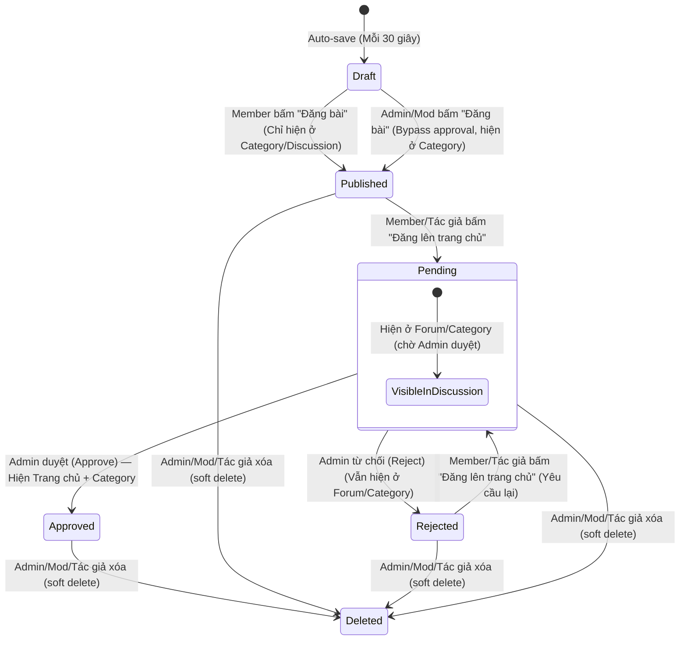

## 1. OVERVIEW

Dự án **AI_Lab** là một diễn đàn/mạng xã hội ngách (Mini-Medium) dành cho cộng đồng người dùng AI tại Việt Nam để chia sẻ thủ thuật, hướng dẫn sử dụng (Tutorials) và các đoạn mã lệnh (Prompts) thực tế.

Tài liệu này đặc tả chi tiết các chức năng cốt lõi cho cả Backend (Laravel 13 API) và Frontend (Next.js 16), tích hợp hệ thống phân quyền nâng cao (Admin, Moderator, Member), cơ chế lưu nháp thông minh theo danh mục, xử lý nội dung hỗ trợ Markdown & BBCode đặc biệt, và hệ thống báo cáo vi phạm nội dung.

---

## 2. CONTEXT

- **Modules**: 
  - `Auth`: Quản lý tài khoản, phân quyền RBAC (`admin`, `moderator`, `member`).
  - `Post`: Tạo bài viết, quản lý trạng thái, danh mục, tags, lưu nháp.
  - `Comment`: Bình luận đa cấp (nested comments) và thích bình luận.
  - `Report`: Hệ thống báo cáo vi phạm cho bài viết và bình luận.
  - `AdminUser`: Quản lý thành viên (cấm, đổi role, xóa).
  - `AdminPost`: CRUD bài viết trực tiếp (bypass approval).
  - `AdminComment`: Quản lý bình luận (xem, xóa).
  - `AdminCategory`: Quản lý danh mục (thêm, sửa, xóa, sắp xếp).
  - `AdminAnalytics`: Thống kê và biểu đồ hệ thống.
- **Features**:
  - Trang chủ (Grid bài viết nổi bật được duyệt bởi Admin/Mod).
  - Trang chi tiết bài viết (Hỗ trợ markdown/bbcode, sao chép code block, bình luận).
  - Diễn đàn thảo luận (Danh sách danh mục, bài viết thảo luận của thành viên).
  - Không gian cá nhân (Dashboard viết bài, quản lý bài viết, auto-save nháp).
  - **Admin Dashboard**: Quản lý user, phê duyệt bài lên trang chủ, quản lý báo cáo, CRUD bài viết/bình luận/danh mục, thống kê hệ thống.
- **Guards**: `api` (Sanctum - sử dụng Access Token / Bearer Token) dùng cho việc xác thực các API người dùng và admin.
- **Third-parties**: `sceditor` (Frontend WYSIWYG Editor), `Spatie Laravel Permission` (RBAC).

---

## 3. OUT OF SCOPE

- **Chia sẻ bài viết lên mạng xã hội bên ngoài**: Chỉ hỗ trợ nút sao chép link chia sẻ nhanh ở frontend, chưa tích hợp API của các MXH khác (Facebook SDK, Twitter API).
- **Hệ thống Chat trực tiếp**: Diễn đàn không tích hợp bất kỳ chức năng chat trực tiếp nào giữa người dùng.
- **Hệ thống thông báo (Notifications / Realtime notifications)**: Được đưa hoàn toàn ra ngoài phạm vi dự án ở thời điểm hiện tại (để sau làm).

---

## 4. BUSINESS RULES

### Quản lý Bài viết & Trạng thái (Post Rules)
- **PROPOSED_BR:post-homepage-eligibility**: Chỉ các bài viết của Admin, Moderator, hoặc bài viết của Member được Admin phê duyệt (`status = 4` - Approved) mới xuất hiện trên Trang chủ.
- **PROPOSED_BR:post-discussion-visibility**: Mọi bài viết của Member khi tạo mới thành công sẽ ở trạng thái `Published` (`status = 2`), tự động xuất hiện ngay lập tức tại mục Thảo luận (Discussion) của Danh mục (`Category`) tương ứng, nhưng chưa xuất hiện trên Trang chủ.
- **PROPOSED_BR:post-auto-publish-mod-admin**: Bài viết do Admin hoặc Moderator đăng sẽ tự động chuyển sang trạng thái `Approved` (`status = 4`) và xuất hiện trên Trang chủ ngay lập tức.
- **PROPOSED_BR:post-promotion-flow**: Người dùng thông thường có nút "Đăng lên trang chủ" trong trang quản lý bài viết cá nhân. Khi nhấn, trạng thái chuyển thành `Pending` (`status = 1`) và gửi yêu cầu đến Admin phê duyệt.
- **PROPOSED_BR:post-rejection-flow**: Khi Admin từ chối duyệt một bài viết lên Trang chủ, trạng thái bài viết chuyển sang `Rejected` (`status = 3`). Bài viết vẫn hiển thị bình thường ở Category tương ứng, hiển thị trong Dashboard cá nhân của tác giả kèm icon con mắt để xem lý do bị từ chối.
- **PROPOSED_BR:post-delete-policy**: Bài viết chỉ được sửa/xóa bởi tác giả của bài viết đó, hoặc bởi Admin và Moderator. Khi Admin xóa bài của user, bài viết chuyển sang trạng thái `Deleted` (`status = 5`) và bị force delete.

### Hệ thống Lưu nháp (Draft Rules)
- **PROPOSED_BR:draft-category-isolation**: Bản ghi nháp (`draft`) được lưu cô lập theo từng Danh mục (`category_id`) của mỗi người dùng (`user_id`). Người dùng có thể viết dở bài ở danh mục A (lưu nháp A) và sang danh mục B viết bài mới độc lập (lưu nháp B).
- **PROPOSED_BR:draft-auto-cleanup**: Khi bài viết chính thức được đăng (submit thành công), bản ghi nháp tương ứng với `(user_id, category_id, post_id)` sẽ bị xóa vĩnh viễn khỏi hệ thống.

### Hệ thống Báo cáo Vi phạm (Report Rules)
- **PROPOSED_BR:report-auth-required**: Chỉ người dùng đã đăng nhập (`member`, `moderator`) mới có quyền gửi báo cáo vi phạm bài viết hoặc bình luận. Guest không được phép gửi báo cáo.
- **PROPOSED_BR:report-rate-limit**: Mỗi tài khoản chỉ được gửi tối đa 5 báo cáo vi phạm trong vòng 1 giờ để tránh spam hệ thống.

---

## 5. REQUIREMENT ANALYSIS

### 5.1. Phân quyền vai trò người dùng (Spatie RBAC)
Hệ thống sử dụng Spatie Laravel Permission kế thừa từ `02-role.md` và bổ sung thêm vai trò `moderator`:
1. **Admin**: Toàn quyền hệ thống, quản lý User, duyệt bài lên trang chủ, quản trị Report Queue, CRUD bài viết/bình luận.
2. **Moderator (Mod)**: Đăng bài lên thẳng Trang chủ, có nút Edit/Delete bài viết & bình luận của bất kỳ ai trực tiếp trên giao diện user. Được phép truy cập Admin Dashboard nhưng giới hạn chỉ vào một số trang nhất định: Duyệt bài (Approval Queue), Báo cáo vi phạm (Reports), và Bài viết (Posts).
3. **Member**: Đăng bài lên mục Thảo luận, có thể yêu cầu Admin duyệt bài lên Trang chủ, chỉ sửa/xóa bài viết & bình luận của chính mình, gửi báo cáo vi phạm.

### 5.2. Luồng Trạng thái Bài viết (Post Lifecycle)

> **Ghi chú triển khai:**  
> - `Member` đăng bài → status = `PUBLISHED` (hiển thị ở Discussion/Category).  
> - `Admin/Mod` đăng bài → status = `PUBLISHED` (bypass approval, hiện ở Category nhưng **không** tự lên Trang chủ).  
> - Để bài lên Trang chủ phải qua quy trình `promotePost` → `PENDING` → Admin `APPROVE` → `APPROVED`.

### 5.3. Xử lý Nội dung (BBCode & Markdown Parsing)
- **`[similar][/similar]`**:
  - Backend lưu trữ nguyên văn thẻ `[similar][/similar]` trong nội dung bài viết.
  - Khi frontend (Next.js) nhận nội dung bài viết từ API, nó sẽ tìm thẻ này và thay thế bằng React component `<SimilarPostsList postId={id} tag={tag} />`. Component này sẽ gọi API `/api/posts/{id}/similar?tag={keyword}` để lấy danh sách 5 bài viết có tag trùng khớp nhất để hiển thị.

### 5.4. Chức năng Admin Dashboard

Hệ thống Admin Dashboard cung cấp giao diện quản trị cho Admin để quản lý toàn bộ nội dung và người dùng của hệ thống.

#### 5.4.1. Quản lý Hàng đợi Duyệt bài (Approval Queue)
- **Xem danh sách bài chờ duyệt**: Hiển thị các bài viết ở trạng thái `PENDING`.
- **Lọc**: Theo danh mục (`category_id`).
- **Xem danh sách bài đã từ chối**: Tab riêng hiển thị các bài ở trạng thái `REJECTED`, lọc theo khoảng ngày (`from_date`, `to_date`).
- **Phê duyệt**: Chuyển trạng thái từ `PENDING` → `APPROVED`.
- **Từ chối**: Chuyển trạng thái từ `PENDING` → `REJECTED`, yêu cầu nhập lý do từ chối (tối thiểu 10 ký tự, tối đa 1000 ký tự).

#### 5.4.2. Quản lý Hàng đợi Báo cáo (Report Queue)
- **Xem danh sách báo cáo**: Hiển thị các báo cáo vi phạm từ Member/Mod.
- **Lọc**: Theo trạng thái (pending/resolved/dismissed), loại (post/comment).
- **Xử lý báo cáo**:
  - **Resolve**: Xóa nội dung vi phạm (soft delete), cập nhật report status.
  - **Dismiss**: Bác bỏ báo cáo, cập nhật report status.

#### 5.4.3. Quản lý Thành viên (User Management)
- **Xem danh sách**: Tất cả users với filter theo role, trạng thái, tìm kiếm.
- **Thay đổi Role**: Nâng/hạ cấp giữa `member`, `moderator`, `admin`.
  - Validation: Không thể tự thay đổi role của chính mình.
  - Validation: Chỉ có thể gán role thấp hơn hoặc bằng role của mình.
- **Cấm tài khoản (Ban)**: 
  - Thay đổi status thành `BANNED`.
  - Yêu cầu lý do cấm (tối thiểu 10 ký tự, tối đa 1000 ký tự).
  - Tùy chọn thời hạn ban (số ngày, tối đa 3650 ngày). Không nhập = ban vĩnh viễn.
  - Khi ban: toàn bộ bài viết của user bị soft delete và ẩn.
  - Validation: Không thể ban Admin.
- **Gỡ cấm (Unban)**: Khôi phục status thành `ACTIVE`, tự động restore lại bài viết cũ của user.
- **Xóa tài khoản**: Soft delete user và nội dung của họ.
  - Validation: Không thể xóa chính mình.
  - Validation: Không thể xóa admin khác.

#### 5.4.4. Quản lý Bài viết (Post CRUD)
- **Xem tất cả bài viết**: Filter theo status, danh mục, tác giả; hỗ trợ search và sort.
- **Tạo bài viết**: Admin tạo bài viết → auto `PUBLISHED` (bypass approval, bài hiện ở Category nhưng chưa lên Trang chủ).
- **Chỉnh sửa**: Admin có thể edit bất kỳ bài viết nào (kể cả soft-deleted).
- **Xem Thùng rác (Trashed)**: Danh sách riêng các bài đã soft delete.
- **Xóa bài viết**:
  - Soft delete: Bài viết bị ẩn nhưng vẫn còn trong DB. Nếu bài có lượt thích/bình luận, yêu cầu xác nhận thêm (`confirm=true`).
  - Hard delete (Force delete): Xóa hoàn toàn khỏi DB (chỉ áp dụng với soft-deleted posts).
  - Restore: Khôi phục bài viết đã soft delete về trạng thái trước khi xóa.

#### 5.4.6. Quản lý Danh mục (Category Management)
- **Xem danh sách**: Tất cả categories với thứ tự sắp xếp.
- **Tạo danh mục**: Admin nhập `name`, `slug` (tự do, không auto-generate), `description`.
- **Cập nhật**: Thay đổi name, description.
- **Xóa danh mục**: 
  - Validation: Không thể xóa category đang có bài viết.
  - Có thể chuyển bài viết sang category khác trước khi xóa.

#### 5.4.7. Thống kê & Analytics
- **Dashboard Overview** (theo khoảng thời gian được chọn): 
  - Tổng lượt xem (views) trong kỳ.
  - Bài viết mới, users mới, bình luận mới trong kỳ.
  - Tổng tích lũy: tổng users, tổng bài viết, tổng bình luận.
  - Số bài viết đang chờ duyệt (`PENDING`).
- **Biểu đồ thống kê**: Theo khoảng thời gian (`today`, `7days`, `30days`, `year`).
  - Dạng ngày (daily) với `today`, `7days`, `30days`; dạng tháng (monthly) với `year`.
  - Các loại metric: `views`, `posts`, `users`, `comments`.
- **Top Content**:
  - Top bài viết nổi bật (theo views_count).
  - Top thành viên tích cực (theo số bài viết + bình luận trong kỳ).
- **Hoạt động gần đây**: User mới đăng ký, bài viết mới, bình luận mới, báo cáo vi phạm mới (hợp nhất và sắp xếp theo thời gian).

---

## 6. DATA MODEL UPDATES

### 6.1. Table: `categories`
Bảng lưu trữ danh mục diễn đàn (được sinh sẵn).

| Column | Type | Length | Null | Unique | Default | Action | Description | Notes |
|--------|------|--------|------|--------|---------|--------|-------------|-------|
| id | bigint | 20 | NO | YES | — | ADDED | Primary key | Auto-increment |
| name | string | 255 | NO | NO | — | ADDED | Tên danh mục | Ví dụ: "AI Prompts", "Tutorials" |
| slug | string | 255 | NO | YES | — | ADDED | Slug danh mục | — |
| description | text | — | YES | NO | NULL | ADDED | Mô tả ngắn | — |
| created_at | timestamp | — | YES | NO | NULL | ADDED | Thời gian tạo | — |
| updated_at | timestamp | — | YES | NO | NULL | ADDED | Thời gian cập nhật | — |

### 6.2. Table: `posts`
Bảng lưu trữ thông tin bài viết.

| Column | Type | Length | Null | Unique | Default | Action | Description | Notes |
|--------|------|--------|------|--------|---------|--------|-------------|-------|
| id | bigint | 20 | NO | YES | — | ADDED | Primary key | Auto-increment |
| user_id | bigint | 20 | NO | NO | — | ADDED | FK -> users.id | Tác giả bài viết |
| category_id | bigint | 20 | NO | NO | — | ADDED | FK -> categories.id | Danh mục bài viết |
| title | string | 255 | NO | NO | — | ADDED | Tiêu đề bài viết | — |
| content | longText | — | NO | NO | — | ADDED | Nội dung bài viết | Chứa BBCode và Markdown |
| summary | text | — | YES | NO | NULL | ADDED | Tóm tắt bài viết | Khởi tạo tự động hoặc trích xuất từ 150 ký tự đầu tiên của bài viết |
| status | tinyInteger | — | NO | NO | 1 | ADDED | Trạng thái bài viết | Xem Enum: `PostStatus` |
| views_count | integer | — | NO | NO | 0 | ADDED | Số lượt xem bài | — |
| reject_reason | text | — | YES | NO | NULL | ADDED | Lý do từ chối duyệt | Chỉ có khi status = Rejected |
| created_at | timestamp | — | YES | NO | NULL | ADDED | Thời gian tạo | — |
| updated_at | timestamp | — | YES | NO | NULL | ADDED | Thời gian cập nhật | — |

### 6.3. Table: `tags`
Bảng lưu trữ các từ khóa/tag của bài viết.

| Column | Type | Length | Null | Unique | Default | Action | Description | Notes |
|--------|------|--------|------|--------|---------|--------|-------------|-------|
| id | bigint | 20 | NO | YES | — | ADDED | Primary key | Auto-increment |
| name | string | 255 | NO | YES | — | ADDED | Tên tag | — |
| slug | string | 255 | NO | YES | — | ADDED | Slug tag | — |
| created_at | timestamp | — | YES | NO | NULL | ADDED | Thời gian tạo | — |
| updated_at | timestamp | — | YES | NO | NULL | ADDED | Thời gian cập nhật | — |

### 6.4. Table: `post_tag` (Pivot Table)
Bảng trung gian liên kết bài viết và tags.

| Column | Type | Length | Null | Unique | Default | Action | Description | Notes |
|--------|------|--------|------|--------|---------|--------|-------------|-------|
| id | bigint | 20 | NO | YES | — | ADDED | Primary key | Auto-increment |
| post_id | bigint | 20 | NO | NO | — | ADDED | FK -> posts.id | Liên kết bài viết |
| tag_id | bigint | 20 | NO | NO | — | ADDED | FK -> tags.id | Liên kết tag |

### 6.5. Table: `comments`
Bảng lưu trữ bình luận đa cấp.

| Column | Type | Length | Null | Unique | Default | Action | Description | Notes |
|--------|------|--------|------|--------|---------|--------|-------------|-------|
| id | bigint | 20 | NO | YES | — | ADDED | Primary key | Auto-increment |
| post_id | bigint | 20 | NO | NO | — | ADDED | FK -> posts.id | Bài viết được bình luận |
| user_id | bigint | 20 | NO | NO | — | ADDED | FK -> users.id | Người viết bình luận |
| parent_id | bigint | 20 | YES | NO | NULL | ADDED | FK -> comments.id | Bình luận chi tiết (nếu có) |
| content | text | — | NO | NO | — | ADDED | Nội dung bình luận | — |
| created_at | timestamp | — | YES | NO | NULL | ADDED | Thời gian tạo | — |
| updated_at | timestamp | — | YES | NO | NULL | ADDED | Thời gian cập nhật | — |

### 6.6. Table: `post_likes`
Bảng lưu trữ thông tin lượt thích bài viết (đảm bảo mỗi user chỉ thích 1 lần).

| Column | Type | Length | Null | Unique | Default | Action | Description | Notes |
|--------|------|--------|------|--------|---------|--------|-------------|-------|
| id | bigint | 20 | NO | YES | — | ADDED | Primary key | Auto-increment |
| post_id | bigint | 20 | NO | NO | — | ADDED | FK -> posts.id | Bài viết được thích |
| user_id | bigint | 20 | NO | NO | — | ADDED | FK -> users.id | Người thích |
| created_at | timestamp | — | YES | NO | NULL | ADDED | Thời gian tạo | — |

### 6.7. Table: `comment_likes`
Bảng lưu trữ thông tin lượt thích bình luận.

| Column | Type | Length | Null | Unique | Default | Action | Description | Notes |
|--------|------|--------|------|--------|---------|--------|-------------|-------|
| id | bigint | 20 | NO | YES | — | ADDED | Primary key | Auto-increment |
| comment_id | bigint | 20 | NO | NO | — | ADDED | FK -> comments.id | Bình luận được thích |
| user_id | bigint | 20 | NO | NO | — | ADDED | FK -> users.id | Người thích |
| created_at | timestamp | — | YES | NO | NULL | ADDED | Thời gian tạo | — |

### 6.8. Table: `drafts`
Bảng lưu trữ tạm thời các bài viết nháp tự động lưu theo danh mục.

| Column | Type | Length | Null | Unique | Default | Action | Description | Notes |
|--------|------|--------|------|--------|---------|--------|-------------|-------|
| id | bigint | 20 | NO | YES | — | ADDED | Primary key | Auto-increment |
| user_id | bigint | 20 | NO | NO | — | ADDED | FK -> users.id | Chủ sở hữu bản nháp |
| category_id | bigint | 20 | NO | NO | — | ADDED | FK -> categories.id | Danh mục của bản nháp |
| post_id | bigint | 20 | YES | NO | NULL | ADDED | FK -> posts.id | ID bài viết gốc (nếu là chỉnh sửa) |
| title | string | 255 | YES | NO | NULL | ADDED | Tiêu đề nháp | — |
| content | longText | — | YES | NO | NULL | ADDED | Nội dung nháp | — |
| tags | json | — | YES | NO | NULL | ADDED | Mảng danh sách tags nháp | — |
| created_at | timestamp | — | YES | NO | NULL | ADDED | Thời gian tạo | — |
| updated_at | timestamp | — | YES | NO | NULL | ADDED | Thời gian cập nhật | — |

> **Unique Constraint**: Hệ thống áp dụng Unique Index trên tổ hợp `(user_id, category_id, post_id)` để đảm bảo mỗi người dùng chỉ có tối đa một bản nháp cho mỗi danh mục và bài viết đang soạn thảo.

### 6.9. Table: `reports`
Bảng lưu trữ thông tin báo cáo vi phạm bài viết hoặc bình luận.

| Column | Type | Length | Null | Unique | Default | Action | Description | Notes |
|--------|------|--------|------|--------|---------|--------|-------------|-------|
| id | bigint | 20 | NO | YES | — | ADDED | Primary key | Auto-increment |
| user_id | bigint | 20 | NO | NO | — | ADDED | FK -> users.id | Người gửi báo cáo (Member/Mod) |
| reportable_type | string | 255 | NO | NO | — | ADDED | Morph Class | `App\Models\Post` hoặc `App\Models\Comment` |
| reportable_id | bigint | 20 | NO | NO | — | ADDED | Morph ID | ID bài viết hoặc ID bình luận |
| reason | text | — | NO | NO | — | ADDED | Lý do báo cáo vi phạm | — |
| status | tinyInteger | — | NO | NO | 1 | ADDED | Trạng thái xử lý | Xem Enum: `ReportStatus` |
| resolved_by | bigint | 20 | YES | NO | NULL | ADDED | FK -> users.id | Admin xử lý báo cáo |
| resolved_at | timestamp | — | YES | NO | NULL | ADDED | Thời gian xử lý | — |
| created_at | timestamp | — | YES | NO | NULL | ADDED | Thời gian tạo | — |
| updated_at | timestamp | — | YES | NO | NULL | ADDED | Thời gian cập nhật | — |

---

### 6.10. Enums

#### Enum: `PostStatus`
Trạng thái bài viết (`posts.status`), kiểu dữ liệu database: `tinyInteger`.

| Value (int) | Name | Description | Localization Key |
|-------------|------|-------------|------------------|
| 1 | PENDING | Chờ duyệt lên trang chủ | `enums.post_status.pending` |
| 2 | PUBLISHED | Đã đăng (Chỉ hiển thị ở thảo luận category) | `enums.post_status.published` |
| 3 | REJECTED | Bị từ chối lên trang chủ (Vẫn hiển thị ở thảo luận category, có lý do) | `enums.post_status.rejected` |
| 4 | APPROVED | Đã duyệt lên trang chủ (Hiển thị trang chủ + thảo luận category) | `enums.post_status.approved` |
| 5 | DELETED | Đã bị xóa (Được soft-delete và hiển thị đã xóa) | `enums.post_status.deleted` |

**Transitions:**
| From | To | Trigger |
|------|----|---------|
| — | published | Member tạo bài viết mới |
| — | approved | Admin/Mod tạo bài viết mới |
| published | pending | Member gửi yêu cầu duyệt lên Trang chủ |
| rejected | pending | Member gửi lại yêu cầu duyệt sau khi bị từ chối |
| pending | approved | Admin phê duyệt bài viết lên Trang chủ |
| pending | rejected | Admin từ chối duyệt bài viết (yêu cầu nhập lý do từ chối) |
| * | deleted | Admin/Mod/Tác giả xóa bài viết |

---

#### Enum: `ReportStatus`
Trạng thái báo cáo vi phạm (`reports.status`), kiểu dữ liệu database: `tinyInteger`.

| Value (int) | Name | Description | Localization Key |
|-------------|------|-------------|------------------|
| 1 | PENDING | Báo cáo đang chờ xử lý | `enums.report_status.pending` |
| 2 | RESOLVED | Đã xử lý (Nội dung bị báo cáo đã bị xóa) | `enums.report_status.resolved` |
| 3 | DISMISSED | Bác bỏ báo cáo (Nội dung hợp lệ, không vi phạm) | `enums.report_status.dismissed` |

**Transitions:**
| From | To | Trigger |
|------|----|---------|
| pending | resolved | Admin bấm nút xóa nội dung vi phạm trên trang quản trị |
| pending | dismissed | Admin bấm nút bác bỏ báo cáo vi phạm |

---

## 7. PROCESSING FLOWS

### Flow 1: Đăng Bài Viết Mới và Xử Lý Nháp
1. Người dùng truy cập form viết bài, chọn **Category** và soạn thảo.
2. Hệ thống tự động kích hoạt bộ lưu nháp sau mỗi 30 giây (gọi API Auto-save).
   **State Changes (Auto-save):**
   - `drafts` = UPSERT `[user_id, category_id, post_id = null]` với dữ liệu `title`, `content`, `tags`.
3. Người dùng bấm nút **Đăng bài**.
4. Hệ thống kiểm tra vai trò người dùng:
   - **Nếu là Member**: Tạo bài viết với trạng thái `PUBLISHED`.
     **State Changes (Member Publish):**
     - `posts` = INSERT `[user_id, category_id, title, content, status = PostStatus::PUBLISHED, views_count = 0]`
     - Khởi tạo tự động hoặc trích xuất từ 150 ký tự đầu tiên của bài viết lưu vào `posts.summary`.
     - Gán liên kết tag trong bảng `post_tag`.
     - Xóa bản ghi trong `drafts` ứng với `(user_id, category_id, post_id = null)`.
   - **Nếu là Mod / Admin**: Tạo bài viết với trạng thái `APPROVED`.
     **State Changes (Mod/Admin Publish):**
     - `posts` = INSERT `[user_id, category_id, title, content, status = PostStatus::APPROVED, views_count = 0]`
     - Khởi tạo tự động hoặc trích xuất từ 150 ký tự đầu tiên của bài viết lưu vào `posts.summary`.
     - Gán liên kết tag trong bảng `post_tag`.
     - Xóa bản ghi trong `drafts` ứng với `(user_id, category_id, post_id = null)`.

**Concurrency Handling:**
- Sử dụng Cache lock `publish-post-{user_id}` trong 5 giây tại API Endpoint để ngăn người dùng click đúp gửi trùng bài viết.

**Acceptance Criteria:**
- [ ] Member đăng bài thành công, bài viết hiện ngay trong tab Thảo luận của Category đó, nhưng không xuất hiện ở trang chủ.
- [ ] Mod/Admin đăng bài thành công, bài viết xuất hiện ngay lập tức trên Trang chủ và trang thảo luận.
- [ ] Bản ghi nháp trong database bị xóa sạch ngay sau khi đăng bài thành công.

---

### Flow 2: Admin Duyệt / Từ Chối Bài Viết (Homepage Promotion Queue)
1. Admin truy cập Admin Dashboard, vào danh sách **Approval Queue** (Lọc các bài viết của Member có trạng thái `PENDING`).
2. Admin bấm **Phê duyệt (Approve)**:
   **State Changes (Approve):**
   - `posts.status` = `PostStatus::APPROVED`
3. Admin bấm **Từ chối (Reject)** và nhập lý do:
   **State Changes (Reject):**
   - `posts.status` = `PostStatus::REJECTED`
   - `posts.reject_reason` = `{reason}`

**Acceptance Criteria:**
- [ ] Bài viết được duyệt chuyển sang trạng thái Published và xuất hiện trên Trang chủ.
- [ ] Bài bị từ chối biến mất khỏi trang Thảo luận công khai, tác giả thấy bài viết trong Dashboard cá nhân ở mục "Bị từ chối" và xem được lý do chi tiết.

---

### Flow 3: Thích / Bỏ Thích Bài Viết và Bình Luận (Like/Unlike)
1. Người dùng đã đăng nhập bấm nút **Like** bài viết (hoặc bình luận).
2. Hệ thống kiểm tra xem bản ghi đã tồn tại chưa:
   - **Nếu chưa thích**: Tạo bản ghi thích.
     **State Changes (Like):**
     - `post_likes` (hoặc `comment_likes`) = INSERT `[post_id/comment_id, user_id]`.
   - **Nếu đã thích (bấm Like lần nữa để Unlike)**: Xóa bản ghi thích.
     **State Changes (Unlike):**
     - Xóa bản ghi tương ứng trong `post_likes` (hoặc `comment_likes`).

**Concurrency Handling:**
- Sử dụng DB Unique constraint trên `(post_id, user_id)` và `(comment_id, user_id)`. Nếu có hành động gửi đồng thời từ client, database sẽ chặn lỗi duplicate và trả về thông báo an toàn.

**Acceptance Criteria:**
- [ ] Số lượt thích tăng/giảm tương ứng khi người dùng thao tác thích/bỏ thích.
- [ ] Mỗi người dùng chỉ được tính tối đa 1 lượt thích trên mỗi bài viết hoặc bình luận.

---

### Flow 4: Hệ Thống Báo Cáo Vi Phạm (Report Queue)
1. Người dùng đã đăng nhập (`member`, `moderator`) bấm nút **Báo cáo vi phạm** trên một bài viết hoặc bình luận.
2. Form modal hiện ra yêu cầu nhập lý do.
3. Hệ thống kiểm tra Rate Limit: Nếu gửi quá 5 báo cáo trong 1 giờ qua, chặn lại và báo lỗi.
4. Gửi báo cáo thành công.
   **State Changes (Report):**
   - `reports` = INSERT `[user_id, reportable_type, reportable_id, reason, status = ReportStatus::PENDING]`
5. Trên Admin Dashboard, Admin nhìn thấy báo cáo trong **Report Queue**.
6. Admin thực hiện một trong hai hành động:
   - **Xóa nội dung (Resolve)**: Soft delete nội dung bị báo cáo.
     **State Changes (Resolve):**
     - Xóa bài viết hoặc bình luận tương ứng (soft delete).
     - `reports.status` = `ReportStatus::RESOLVED`
     - `reports.resolved_by` = `{admin_id}`
     - `reports.resolved_at` = `now()`
   - **Bác bỏ báo cáo (Dismiss)**:
     **State Changes (Dismiss):**
     - `reports.status` = `ReportStatus::DISMISSED`
     - `reports.resolved_by` = `{admin_id}`
     - `reports.resolved_at` = `now()`

---

## 8. UI/UX & FRONTEND IMPLICATIONS (NEXT.JS)

### 8.1. Cấu trúc thư mục & Layouts
- Các màn hình Client: `frontend/app/(dashboard)/ai-lab/`
- Giao diện Admin: Tích hợp trực tiếp trên bảng quản trị Admin Backend (Laravel).
- Trình soạn thảo bài viết: Tích hợp thư viện WYSIWYG `sceditor` hỗ trợ tag BBcode và Markdown.

### 8.2. Đồng bộ Lưu Nháp tự động
- Tạo một hook `useAutoSave` sử dụng `lodash.debounce` để gửi request tự động lưu nháp lên API `/api/drafts/autosave` mỗi khi trường tiêu đề hoặc nội dung thay đổi quá 30 giây.
- Khi người dùng chọn danh mục (Category) khác, form tự động tải bản nháp tương ứng của danh mục đó (nếu có) từ API để đổ vào trình soạn thảo.

### 8.3. Xử lý Thẻ `[similar][/similar]`
- Nội dung bài viết hiển thị qua component `ArticleBody.tsx`. Component này sẽ tìm kiếm sự xuất hiện của chuỗi `[similar][/similar]`.
- Thay thế chuỗi này bằng React Component `<SimilarPosts postId={post.id} tags={post.tags} />` để render danh sách thẻ bài viết liên quan có animation hover, hiệu ứng chuyển màu sắc mịn màng.

### 8.5. Bài viết đang HOT & Tác giả yêu thích nhất (Trang chủ)
- **Bài viết đang HOT (Top 5 Posts)**: Hiển thị danh sách 5 bài viết có `views_count` nhiều nhất, sắp xếp giảm dần, có status là `APPROVED`.
- **Tác giả yêu thích nhất (Top 5 Authors)**: Hiển thị 5 tác giả có tổng số lượt thích (likes) tích lũy trên các bài viết của họ nhiều nhất.
- **Tối ưu hóa hiệu năng & Caching**:
  - Do truy vấn thống kê lượt thích của tác giả và bài viết hot trên DB lớn rất nặng, dữ liệu này sẽ được **Cache bằng Redis/Laravel Cache với TTL = 10 phút**.
  - Frontend sẽ fetch dữ liệu này thông qua một request API bất đồng bộ riêng biệt (Lazy Load) sau khi trang chủ đã render phần khung tĩnh xong, giúp giảm thiểu tối đa thời gian chờ First Contentful Paint (FCP) và tránh làm chậm (lag) trang chủ.

### 8.6. Localization Keys (i18n)
Bổ sung các translation keys sau vào file `frontend/i18n/messages/vi.json` và `en.json`:
- `post.status.pending`: "Chờ duyệt trang chủ (Đang thảo luận)"
- `post.status.published`: "Đã đăng trang chủ"
- `post.status.rejected`: "Bị từ chối"
- `post.draft_autosaved`: "Đã tự động lưu nháp lúc {time}"
- `report.submit_success`: "Gửi báo cáo vi phạm thành công. Đội ngũ kiểm duyệt sẽ xử lý sớm."
- `report.error_rate_limit`: "Bạn đã gửi quá nhiều báo cáo. Vui lòng thử lại sau 1 giờ."
- `homepage.hot_posts`: "Bài viết đang HOT"
- `homepage.top_authors`: "Tác giả yêu thích nhất"

---

## 9. API ENDPOINT INVENTORY

| Method | Endpoint | Guard | Description | Related Flow |
|--------|----------|-------|-------------|--------------|
| GET | `/api/posts` | guest | Lấy danh sách bài viết trang chủ (status = 2) | Homepage |
| GET | `/api/posts/hot` | guest | Lấy top 5 bài viết nhiều lượt xem nhất (Cache 10 phút) | Homepage |
| GET | `/api/users/top-authors` | guest | Lấy top 5 tác giả được thích nhiều nhất (Cache 10 phút) | Homepage |
| GET | `/api/posts/{id}` | guest | Lấy chi tiết bài viết (tự động tăng views_count) | Post Detail |
| GET | `/api/posts/{id}/similar` | guest | Lấy danh sách 5 bài viết tương tự theo keyword tag | Similar Widget |
| POST | `/api/posts` | api | Tạo bài viết mới (bằng Member/Mod/Admin) | Flow 1 |
| PUT | `/api/posts/{id}` | api | Cập nhật bài viết | Flow 1 |
| DELETE | `/api/posts/{id}` | api | Xóa bài viết (Chỉ tác giả, Mod, Admin) | Flow 4 |
| GET | `/api/categories` | guest | Lấy danh sách các danh mục | Category List |
| GET | `/api/categories/{slug}/posts` | guest | Lấy bài viết trong Category (bao gồm cả status PENDING) | Forum |
| GET | `/api/posts/{id}/comments` | guest | Lấy danh sách bình luận của bài viết (phân trang 10) | Comments |
| POST | `/api/posts/{id}/comments` | api | Tạo bình luận mới (bao gồm trả lời bình luận cha) | Comments |
| DELETE | `/api/comments/{id}` | api | Xóa bình luận (Chỉ tác giả, Mod, Admin) | Comments |
| POST | `/api/posts/{id}/like` | api | Thích/Bỏ thích bài viết | Flow 3 |
| POST | `/api/comments/{id}/like` | api | Thích/Bỏ thích bình luận | Flow 3 |
| POST | `/api/drafts/autosave` | api | Tự động lưu nháp theo user và category | Flow 1 |
| GET | `/api/drafts` | api | Lấy bản nháp hiện tại theo category_id | Flow 1 |
| POST | `/api/reports` | api | Gửi báo cáo vi phạm nội dung | Flow 4 |

---

## 10. IMPLEMENTATION TASKS

### Phase 1: Tính năng Client & Thành viên (Member / Moderator)
1. Thiết kế cơ sở dữ liệu và khai báo các Eloquent Models (`categories`, `posts`, `tags`, `post_tag`, `comments`, `post_likes`, `comment_likes`, `drafts`, `reports`).
2. Cài đặt vai trò người dùng (`admin`, `moderator`, `member`) sử dụng Spatie Laravel Permission.
3. Phát triển logic nghiệp vụ viết bài, tự động lưu nháp cô lập theo danh mục (`DraftService`) và dọn dẹp nháp khi đăng thành công.
4. Phát triển logic bình luận đa cấp, tính năng thích/bỏ thích và gửi báo cáo vi phạm nội dung (kèm Rate Limit).
5. Xây dựng giao diện Client Next.js: Trang chủ (Grid bài viết), Trang chi tiết bài viết (BBCode rendering, code copy, component `SimilarPosts` tải 5 bài viết tương tự), và Trình soạn thảo viết bài tích hợp SCEditor và tự động đồng bộ nháp.

### Phase 2: Hệ thống quản trị Admin (Admin Dashboard)
6. Phát triển bộ thống kê số liệu tổng quan hệ thống và biểu đồ dữ liệu theo thời gian (views, posts, users, comments).
7. Phát triển các cổng API/giao diện cho hàng đợi duyệt bài (Approval Queue - trạng thái `PENDING` thành `APPROVED` hoặc `REJECTED` kèm lý do) và hàng đợi xử lý báo cáo vi phạm (Resolve/Dismiss).
8. Phát triển cụm quản lý người dùng (Ban/Unban, đổi quyền hạn) và CRUD các danh mục bài viết (Category CRUD), bài viết (Post CRUD), và bình luận (Comment Management).

### Phase 3: Kiểm thử & Đảm bảo Chất lượng (Testing & QA)
9. Viết các bộ Feature & Unit Test (PHPUnit) bảo vệ toàn bộ API nghiệp vụ thành viên và quản trị ở Backend.
10. Xây dựng kịch bản kiểm thử Vitest và Playwright E2E để xác thực toàn bộ luồng hoạt động từ Client đến Admin Dashboard.
