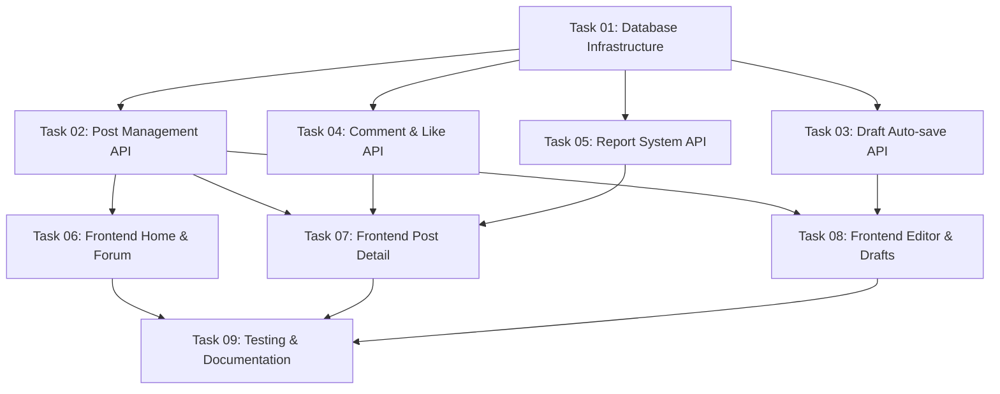

# Implementation Plan: AI_Lab

This document tracks the high-level implementation of the AI_Lab forum and prompt-sharing platform based on the [03-ai_lab.md](../requirements/03-ai_lab.md) requirement specification.

---

## Progress Summary

- **Total Tasks**: 9
- **Completed**: 1 / 9 (11%)
- **Phase 1 (Foundation)**: ✅ 1/1
- **Phase 2 (Backend API & Services)**: ⏳ 0/4
- **Phase 3 (Frontend)**: ⏳ 0/3
- **Phase 4 (Quality & Documentation)**: ⏳ 0/1
- **Estimated Total Effort**: 14h (AI) + 38h (Dev) = 52h

---

## Task Modules

The implementation is divided into 9 modules across 4 phases. Each module contains detailed tasks and dependencies.

### Phase 1: Foundation

| # | Task Module | Type | Effort | Link | Status |
| :--- | :--- | :--- | :--- | :--- | :--- |
| 1 | **Database Infrastructure & Setup** | IMPL | M | [Task 01](./2026-06-05-ai-lab/task-01-database-infrastructure.md) | ✅ Completed |

### Phase 2: Backend API & Services

| # | Task Module | Type | Effort | Link | Status |
| :--- | :--- | :--- | :--- | :--- | :--- |
| 2 | **Post Management API** | IMPL | M | [Task 02](./2026-06-05-ai-lab/task-02-post-management-api.md) | ⏳ Pending |
| 3 | **Draft Auto-save API** | IMPL | S | [Task 03](./2026-06-05-ai-lab/task-03-draft-autosave-api.md) | ⏳ Pending |
| 4 | **Comment & Like API** | IMPL | M | [Task 04](./2026-06-05-ai-lab/task-04-comment-like-api.md) | ⏳ Pending |
| 5 | **Report System & Queue API** | IMPL | S | [Task 05](./2026-06-05-ai-lab/task-05-report-system-api.md) | ⏳ Pending |

### Phase 3: Frontend

| # | Task Module | Type | Effort | Link | Status |
| :--- | :--- | :--- | :--- | :--- | :--- |
| 6 | **Frontend Home & Forum Views** | IMPL | M | [Task 06](./2026-06-05-ai-lab/task-06-frontend-views.md) | ✅ Completed |
| 7 | **Frontend Post Detail & Comments** | IMPL | M | [Task 07](./2026-06-05-ai-lab/task-07-frontend-detail-comments.md) | ⏳ Pending |
| 8 | **Frontend Dashboard & Editor Auto-save** | IMPL | M | [Task 08](./2026-06-05-ai-lab/task-08-frontend-dashboard-drafts.md) | ⏳ Pending |

### Phase 4: Quality & Documentation

| # | Task Module | Type | Effort | Link | Status |
| :--- | :--- | :--- | :--- | :--- | :--- |
| 9 | **Testing & Logic Documentation** | IMPL | M | [Task 09](./2026-06-05-ai-lab/task-09-testing-documentation.md) | ⏳ Pending |

---

## Dependency Graph

---

## 🚦 Execution Order Recommendation

1. **Task 01: Database Infrastructure & Setup** — Must be implemented first to lay down all tables, columns, constraints, models, seeders, and roles.
2. **Tasks 02, 03, 04, 05 (Backend APIs)** — Can be implemented concurrently. Task 02 is required before Frontend starts. Task 03 is needed for drafting features. Task 04 is needed for engagement features. Task 05 is needed for moderation features.
3. **Tasks 06, 07, 08 (Frontend)** — Can be done once Task 02 is completed. Work can run in parallel.
4. **Task 09: Testing & Logic Documentation** — Final phase to cover all unit, feature, integration, and E2E tests, and write the logic documentation.
