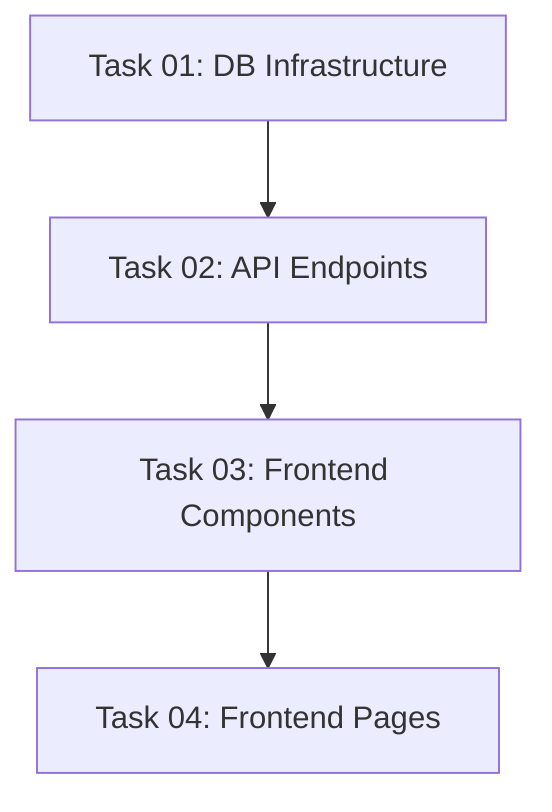

# Implementation Plan: User Profile

This document tracks the high-level implementation of User Profile based on the [04-user-profile.md](../requirements/04-user-profile.md).

## Progress Summary

- **Total Tasks**: 4
- **Completed**: 1 / 4 (25%)
- **Phase 1 (Foundation)**: ✅ 1/1
- **Phase 2 (Backend API & Services)**: ⏳ 0/1
- **Phase 3 (Frontend)**: ⏳ 0/2
- **Phase 4 (Quality & Documentation)**: ✅ 0/0
- **Estimated Total Effort**: M

## Task Modules

The implementation is divided into 4 modules across 3 phases. Each module contains detailed tasks and dependencies.

### Phase 1: Foundation

| # | Task Module | Type | Effort | Link | Status |
| :--- | :--- | :--- | :--- | :--- | :--- |
| 01 | **Database Infrastructure for User Profile** | IMPL | S | [Task 01](./2026-06-17-user-profile/01-database-infrastructure.md) | ✅ Completed |

### Phase 2: Backend API & Services

| # | Task Module | Type | Effort | Link | Status |
| :--- | :--- | :--- | :--- | :--- | :--- |
| 02 | **API Endpoints for User Profile** | IMPL | M | [Task 02](./2026-06-17-user-profile/02-api-endpoints.md) | ✅ Completed |

### Phase 3: Frontend

| # | Task Module | Type | Effort | Link | Status |
| :--- | :--- | :--- | :--- | :--- | :--- |
| 03 | **Frontend UI Components for User Profile** | IMPL | L | [Task 03](./2026-06-17-user-profile/03-frontend-components.md) | ✅ Completed |
| 04 | **Frontend Pages and API Integration** | IMPL | M | [Task 04](./2026-06-17-user-profile/04-frontend-pages.md) | ✅ Completed |

## Dependency Graph

## 🚦 Execution Order Recommendation

1. **Task 01: Database Infrastructure for User Profile** — Migration DB.
2. **Task 02: API Endpoints for User Profile** — Viết API để frontend có thể call.
3. **Task 03: Frontend UI Components for User Profile** — Xây dựng giao diện.
4. **Task 04: Frontend Pages and API Integration** — Tích hợp API và Routing.
