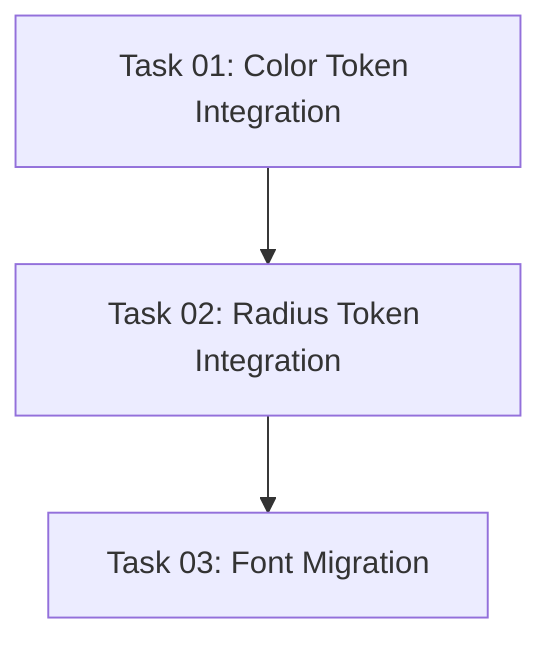

# Implementation Plan: Canvix Design System Integration

This document tracks the high-level implementation of the Canvix Design System alignment based on the [canvix.io-DESIGN.md](../draft/canvix.io-DESIGN.md).

## Progress Summary

- **Total Tasks**: 3
- **Completed**: 3 / 3 (100%)
- **Phase 1 (Foundation)**: ⏳ 0/0
- **Phase 2 (Backend API & Services)**: ⏳ 0/0
- **Phase 3 (Frontend)**: ✅ 3/3
- **Phase 4 (Quality & Documentation)**: ⏳ 0/0
- **Estimated Total Effort**: S

## Task Modules

The implementation is divided into 3 modules across 1 phase (Phase 3: Frontend). Each module contains detailed tasks and dependencies.

### Phase 3: Frontend

| # | Task Module | Type | Effort | Link | Status |
| :--- | :--- | :--- | :--- | :--- | :--- |
| 01 | **Color Token Integration** | IMPL | S | [Task 01](./2026-06-18-canvix-design-system/01-color-tokens.md) | ✅ Completed |
| 02 | **Radius Token Integration** | IMPL | S | [Task 02](./2026-06-18-canvix-design-system/02-radius-tokens.md) | ✅ Completed |
| 03 | **Plus Jakarta Sans Font Migration** | IMPL | S | [Task 03](./2026-06-18-canvix-design-system/03-font-migration.md) | ✅ Completed |

## Dependency Graph

## 🚦 Execution Order Recommendation

1. **Task 01: Color Token Integration** — Standardize the colors (`--primary`, `--foreground`, `--border`, `--ring`, `--shadow`, etc.) to prevent visual discrepancies early.
2. **Task 02: Radius Token Integration** — Introduce custom border-radius properties to root stylesheet.
3. **Task 03: Plus Jakarta Sans Font Migration** — Swap the font family config and layout loading, verify Vietnamese characters render correctly, and check UI alignment.
