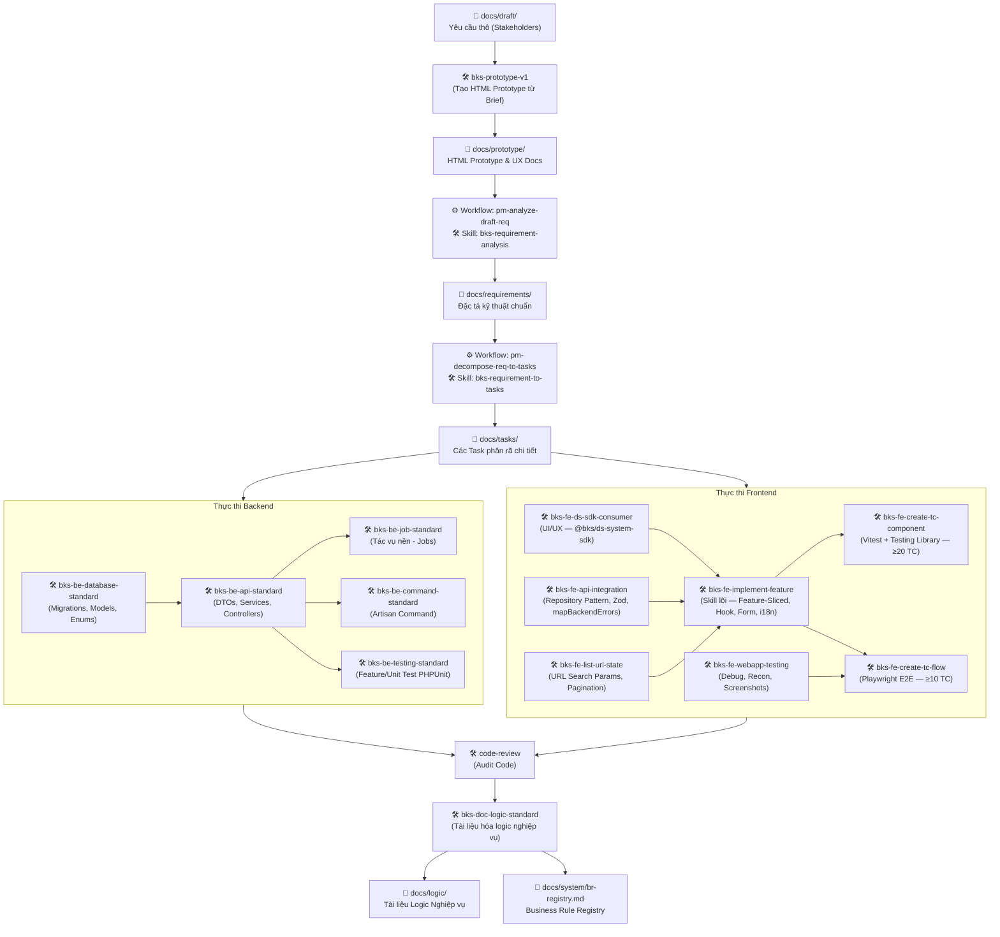

# Cẩm Nang Phát Triển Dự Án & Hướng Dẫn Sử Dụng AI Agent

Chào mừng các thành viên trong nhóm phát triển dự án! Tài liệu này được biên soạn nhằm cung cấp cái nhìn toàn cảnh về kiến trúc hệ thống, quy chuẩn viết code, cấu trúc tài liệu nghiệp vụ, và đặc biệt là cách phối hợp hiệu quả giữa lập trình viên (Developer) và Trợ lý Trí tuệ Nhân tạo (AI Agent) thông qua hệ thống **Skills** và **Workflows**.

Dự án của chúng ta là một ứng dụng hiện đại được xây dựng trên sự kết hợp giữa **Laravel 13** (Backend API) và **Next.js 16** (Frontend App Router), sử dụng mô hình phát triển hướng cấu trúc và tài liệu hóa chặt chẽ.

---

## 🗺️ Sơ Đồ Tổng Quan Các Skill & Luồng Phối Hợp

Hệ thống AI Agent trong dự án được trang bị các **Skills** (Kỹ năng cốt lõi) và **Workflows** (Quy trình làm việc từng bước). Dưới đây là sơ đồ Mermaid mô tả luồng làm việc từ khi tiếp nhận yêu cầu thô cho đến khi hoàn thành tính năng, cùng sự phân vai của các skill liên quan:

---

## 📚 Mục Lục Hướng Dẫn Chi Tiết

Để hiểu rõ và vận hành hệ thống một cách trơn tru, bạn hãy đọc lần lượt các chuyên đề hướng dẫn dưới đây:

### 🔗 [Bài 1: Hướng Dẫn Chi Tiết Các Skill & Quy Trình Làm Việc](./01-skills-workflows.md)
*Tìm hiểu ý nghĩa của các Skills hiện có trong dự án và quy trình phối hợp nhịp nhàng giữa Developer và AI Agent.*

### 📂 [Bài 2: Cấu Trúc Thư Mục Docs & Ý Nghĩa Chi Tiết](./02-folder-structure.md)
*Khám phá cấu trúc thư mục tài liệu `docs/`, luồng đi của tài liệu nghiệp vụ, quy chuẩn đặt mã Business Rule (BR) để AI đọc hiểu nhanh chóng.*

### ⚙️ [Bài 3: Cấu Trúc Backend & Luồng Viết Backend Chuẩn Mực](./03-backend-architecture.md)
*Phân tích kiến trúc Backend Laravel 13 mỏng Controller dày Service, cơ chế luồng dữ liệu một chiều (Unidirectional Data Flow) và quy trình 11 bước chuẩn mực để triển khai một API hoàn chỉnh.*

### 🧪 [Bài 4: Hướng Dẫn Kiểm Thử (Testing Guide)](./04-testing-guide.md)
*Hiểu rõ triết lý kiểm thử hai tầng (Feature / Unit), cấu trúc thư mục `tests/`, quy chuẩn đặt tên, checklist 7 test cases tối thiểu cho mỗi API, và quy trình báo cáo kết quả bắt buộc trong `docs/testing/`.*

### 🖥️ [Bài 5: Kiến Trúc & Luồng Viết Frontend Chuẩn Mực](./05-frontend-architecture.md)
*Khám phá mô hình Feature-Sliced, Repository Pattern, Zustand Store và hệ thống **7 skill bks-fe-*** chuyên biệt không trùng chéo: `bks-fe-implement-feature` (skill lõi), `bks-fe-api-integration` (data layer), `bks-fe-ds-sdk-consumer` (UI/UX), `bks-fe-list-url-state` (URL state), cùng bộ đôi testing `bks-fe-create-tc-component` (Vitest ≥20 TC) và `bks-fe-create-tc-flow` (Playwright ≥10 TC). Quy trình 8 bước chuẩn mực từ types, schema, service, store, hook cho đến component, page và test.*

### 🐳 [Bài 6: Hướng Dẫn Phát Triển Với Docker & Các Lệnh Artisan](./06-docker-guide.md)
*Hướng dẫn chi tiết cách vận hành môi trường Docker, quy chuẩn chạy các lệnh Artisan, Composer và PNPM thông qua `docker exec` để tránh lỗi phân quyền (Permission Denied).*

---

> [!IMPORTANT]
> **Quy Tắc Vàng Khi Làm Việc Với AI Agent:**
> 1. Luôn yêu cầu AI đọc tài liệu nền tảng trong thư mục `docs/system/` trước khi tiến hành chỉnh sửa code.
> 2. Đảm bảo mọi Business Rule mới phải bắt đầu bằng nhãn `PROPOSED_BR:{slug}` trước khi được phê duyệt và ghi danh vào `docs/system/br-registry.md`.
> 3. Tuyệt đối tuân thủ luồng cấu trúc backend một chiều và quy chuẩn validation 3 lớp.
> 4. Mỗi tính năng mới bắt buộc phải có Feature Test trong `tests/Feature/Api/` và báo cáo kết quả trong `docs/testing/` — không được bỏ qua.
